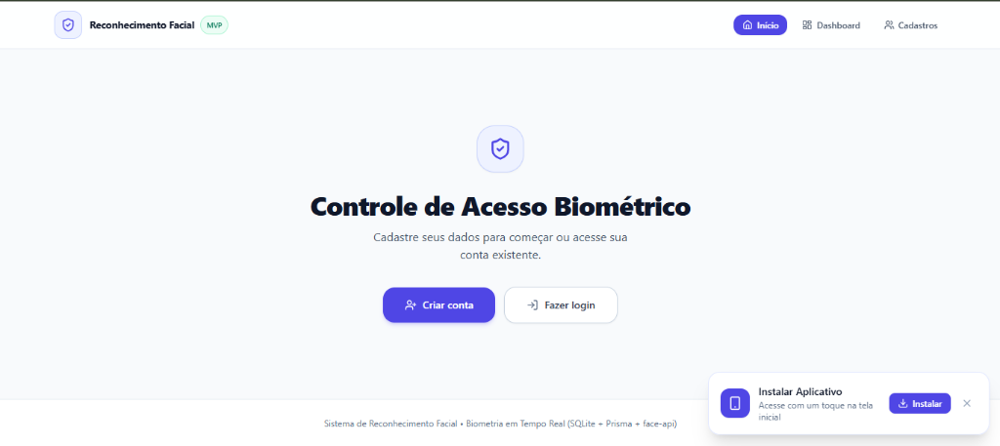
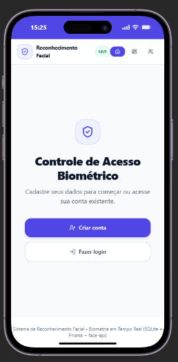

# 👁️ Sistema de Reconhecimento Facial & Controle de Acesso com Liveness (Anti-Spoofing)

<p align="center">
  
  &nbsp;&nbsp;
  
</p>
<p align="center">
  <em>Interfaces Desktop e Mobile (PWA Instalável) do Sistema de Reconhecimento Facial e Controle de Acesso</em>
</p>

<p align="center">
  
  
  
  
  
  
  
  
</p>

---

## 📌 Sobre o Projeto

O **Sistema de Reconhecimento Facial & Controle de Acesso com Liveness** é uma aplicação web progressiva (PWA) de alta segurança para autenticação em dois fatores, validação de presença física em tempo real e gestão de usuários.

O projeto adota uma **arquitetura em camadas desacopladas (Clean Layered Architecture)** com separação rigorosa de responsabilidades entre interface de usuário, aplicação/controladores, regras de negócio, acesso a dados e o motor biométrico de visão computacional.

### 🔑 Princípios Centrais de Negócio & Segurança

1. **Identificação e Autenticação por Credenciais:**
   - O usuário é identificado estritamente por **CPF + Senha criptografada** com PBKDF2/SHA256 e Salt exclusivo, gerando sessão segura via cookie HTTP-Only.
2. **Biometria Focada em Vivacidade (Liveness / Anti-Spoofing):**
   - A câmera **NÃO** é utilizada para adivinhar a identidade do usuário via descritores faciais 1:N.
   - O módulo biométrico atua exclusivamente como **barreira de vivacidade e prova de vida ativa (*Proof of Life / PAD*)**, garantindo que o usuário autenticado está fisicamente presente diante da lente.
3. **Privacidade e Conformidade LGPD (Client-Side AI):**
   - Todo o processamento das redes neurais de visão computacional ocorre localmente no navegador via WebAssembly/WebGL com `@vladmandic/face-api`, sem streaming de vídeo para servidores externos.

---

## 🏛️ Arquitetura do Sistema

A aplicação foi estruturada conceitualmente em camadas bem delimitadas, garantindo que componentes de interface não acessem o banco de dados e que serviços de IA fiquem isolados atrás de abstrações substituíveis.

### 1. Fluxo de Dados e Aplicação
```text
FRONTEND (Next.js Pages & React Components)
   ↓
API ROUTE HANDLERS (app/api/**)
   ↓
CONTROLLERS (lib/controllers/**)
   ↓
SERVICES (lib/services/**)
   ↓
REPOSITORIES (lib/repositories/**)
   ↓
PRISMA ORM & DATABASE (lib/prisma.ts -> SQLite)
```

### 2. Fluxo de Visão Computacional e Liveness
```text
CAMERA SERVICE (lib/camera/camera-service.ts)
   ↓
FACE ENGINE (lib/face-engine/face-engine.ts) [Isola face-api.js]
   ↓
LIVENESS SERVICE (lib/services/liveness-service.ts) [Avaliação PAD e Desafios]
   ↓
LIVENESS CONTROLLER (lib/controllers/liveness-controller.ts)
   ↓
FRONTEND (components/LivenessSecurityVerification.tsx)
```

---

## 🧩 Responsabilidade das Camadas

| Camada | Localização | Responsabilidade |
| :--- | :--- | :--- |
| **Frontend (UI)** | `app/`, `components/` | Renderização visual, interação com o usuário, formulários, máscaras, feedback visual e exibição dos desafios de liveness. Não acessa o Prisma ou banco de dados. |
| **API Handlers** | `app/api/**` | Pontos de entrada HTTP do Next.js App Router. Recebem as requisições e delegam diretamente aos controllers. |
| **Controllers** | `lib/controllers/` | Coordenação do fluxo da aplicação. Recebem os dados, validam o fluxo, acionam os serviços e formatam respostas HTTP padronizadas. |
| **Services** | `lib/services/` | Regras de negócio da aplicação (hashing, sessões, montagem de perfis DTO, extratos e lógica de vivacidade). |
| **Repositories** | `lib/repositories/` | Isolamento total do acesso a dados via Prisma. Concentram todas as queries de persistência de `User` e `Person`. |
| **Camera Service** | `lib/camera/` | Gerenciamento seguro do ciclo de vida da webcam (`MediaStream`), tracks e captura de snapshots. |
| **Face Engine** | `lib/face-engine/` | Abstração que isola a biblioteca externa (`face-api.js`), fornecendo normalização de marcos faciais de forma agnóstica. |
| **Types / DTOs** | `lib/types/` | Definições centralizadas de contratos de interfaces, DTOs e tipagens compartilhadas. |

---

---

## 🔄 Fluxograma do Fluxo do Usuário & Controle de Catraca

```mermaid
flowchart TD
    A[Acesso à Aplicação] --> B{Possui Cadastro no SISRU?}
    B -- Não --> C[Cadastro em /cadastro\nNome, CPF, SIAP, Vínculo, Senha]
    C --> D[Armazenamento Seguro no Repositório]
    D --> E[Login com CPF e Senha]
    B -- Sim --> E
    E --> F[Validação Criptográfica de Senha]
    F --> G{Já possui Biometria Cadastrada?}
    G -- Não (Primeiro Acesso) --> H[Obrigatório: Liveness Inicial de Cadastro]
    G -- Sim --> I[Incrementa Contador de Acessos]
    I --> J{Contador atingiu Sorteio 3 a 5?}
    J -- Não --> K[Acesso Liberado Direto ao Painel!]
    J -- Sim --> L[Auditoria Sorteada: Revalidação de Vivacidade Rápida]
    H --> M[Desafios Rápidos no Topo da Câmera]
    L --> M
    M --> N{Liveness Aprovado?}
    N -- Não --> O[Acesso Bloqueado / Tentar Novamente]
    N -- Sim --> P[Despacho da Foto para Catraca / SISRU\n(Sem retenção desnecessária local)]
    P --> Q[Reseta Contador & Sorteia Novo Gatilho (3-5)]
    Q --> K
    K --> R[Painel Completo Desbloqueado: Extrato & Perfil]
```

---

## 🧠 Motor de Liveness & Anti-Spoofing Acessível (`lib/services/liveness-service.ts`)

A validação de vivacidade foi projetada para combinar **alta segurança contra ataques de apresentação (fotos em papel, telas de celular/monitores)** com **baixa fricção e máxima usabilidade**:

### 1. Instruções no Topo (Card Acima da Câmera)
- O **card do desafio atual foi posicionado diretamente ACIMA da câmera**, garantindo que o usuário visualize a orientação de primeira antes de olhar para a lente.
- Ícone dinâmico representativo (piscar, sorrir leve, virar a cabeça suavemente).
- Barra de progresso integrada em tempo real.

### 2. Dificuldade Calibrada & Desafios Rápidos (2 Etapas)
- **Sequências Amigáveis:** Em vez de etapas exaustivas, cada sessão gera sequências rápidas de **2 etapas** (ex: *Olhar para o centro* $\rightarrow$ *Piscar suavemente* ou *Sorrir de leve*).
- **Tolerância de Rotação (Head Yaw):** Exige apenas uma virada leve de $15^\circ$ a $20^\circ$ (`yawRatio < 0.72` ou `> 1.38`), evitando que o usuário perca o foco da câmera.
- **Detecção Suave de Sorriso:** Limiar flexível (`expressions.happy > 0.32` ou proporção labial moderada), aceitando sorrisos naturais e discretos.
- **Piscada Confortável:** Reconhecimento do ciclo biológico natural de fechar e reabrir os olhos sem esforço forçado.
- **Enquadramento Inclusivo:** Aceita distâncias variadas da webcam/câmera frontal (`faceRatio` de 10% a 94% da largura da imagem).
- **Resposta Instantânea:** Confirmação por 2 frames consecutivos, eliminando travamentos em aparelhos com menor taxa de quadros (FPS).

### 3. Integração SISRU & Despacho para Catracas (`turnstile-service.ts`)
- **Sem Retenção Local Desnecessária:** A foto capturada após aprovação no liveness não fica armazenada permanentemente no banco SQLite local.
- **Envio Direto ao Sistema de Acesso:** A foto e os identificadores (`cpf`, `siap`, `userType`, `timestamp`) são enviados via webhook/API HTTP para o banco de dados da **catraca física** e sincronizados com o **SISRU**.
- **Controle Periódico Aleatório (3 a 5 acessos):** Usuários com biometria já cadastrada entram direto no sistema. A cada **3 a 5 acessos sorteados aleatoriamente**, o sistema requisita uma prova de vida rápida para auditoria e revalidação da presença.

---

## 🌟 Módulos e Telas da Aplicação

### 🔐 1. Página Inicial & Autenticação (`/`)
- Formulário de acesso minimalista por **CPF** e **Senha**.
- Máscara dinâmica de formatação para CPF (`000.000.000-00`).
- Atalho para o fluxo de cadastro e verificação automática de sessão ativa para redirecionamento direto ao dashboard.

### 📝 2. Fluxo de Cadastro de Usuário (`/cadastro`)
- Cadastro guiado com validações em tempo real:
  - **Nome Completo:** Validação de tamanho mínimo;
  - **CPF:** Validação algorítmica completa de 11 dígitos com cálculo dos dígitos verificadores (rejeita CPFs inválidos ou sequências repetidas como `111.111.111-11`);
  - **SIAP:** Identificador funcional/acadêmico obrigatório;
  - **Tipo de Usuário:** Seleção entre *Graduação*, *Pós-graduação*, *Professor* ou *Servidor*;
  - **E-mail:** Validação estrutural de formato RFC;
  - **Senha e Confirmação:** Requisito de tamanho mínimo e paridade.
- Gravação segura no banco com hash criptográfico PBKDF2 e salt exclusivo.

### 📊 3. Dashboard do Usuário com 3 Abas (`/dashboard`)

O painel central divide-se em abas dinâmicas:

1. **Aba Reconhecimento (Liveness Security):**
   - Exibição da webcam em tempo real com indicador de enquadramento circular;
   - Passos visuais do desafio sorteado com barra de progresso individual;
   - Mensagens orientativas imediatas (*"Centralize o rosto"*, *"Piscada detectada! Abra os olhos"*, *"Gire para a direita"*);
   - Temporizador regressivo de 60 segundos;
   - Ao concluir com sucesso, a foto biométrica é salva e as abas confidenciais são liberadas.
2. **Aba Extrato:**
   - Resumo financeiro com saldo atual, entradas e saídas;
   - Histórico categorizado de movimentações (alimentação, serviços, recargas) com datas, valores e comprovantes visuais.
3. **Aba Perfil:**
   - Cartão de identificação completo do usuário;
   - Exibição de Nome, CPF formatado, SIAP, Categoria de Vínculo e E-mail;
   - Crachá biométrico com a foto capturada durante o Liveness e selo de segurança *"Biometria Verificada"*.

### 👥 4. Gestão Administrativa de Cadastros (`/cadastros`)
- Painel para consulta de todos os registros persistidos no SQLite;
- Campo de busca instantânea com filtro por Nome, CPF, SIAP ou E-mail;
- Distintivo visual destacando usuários com biometria facial validada versus pendente;
- Modal para cadastro rápido de novos usuários;
- Exclusão segura com modal de confirmação e duplo clique para prevenir remoções acidentais.

### 📱 5. Experiência Mobile & Progressive Web App (PWA)
- **100% Responsivo:** Layout adaptável e otimizado com Tailwind CSS para smartphones, tablets e telas widescreen;
- **Instalação com 1 Toque:** Banner de instalação personalizado (`InstallPwaPrompt.tsx`) na tela inicial permitindo adicionar o app ao celular;
- **Execução Standalone:** Experiência de aplicativo nativo sem barras de URL ou menus do navegador;
- **Cache Local de Redes Neurais:** Pesos de IA cacheados no dispositivo para carregamento instantâneo.

---

## 🛠️ Stack Tecnológica

| Camada | Tecnologia | Finalidade |
| :--- | :--- | :--- |
| **Framework Full-Stack** | Next.js 14.2 (App Router) | Páginas dinâmicas com SSR/CSR e rotas de API REST |
| **Biblioteca de UI** | React 18 | Interfaces reativas, gerenciamento de estado e hooks |
| **Linguagem** | TypeScript 5 | Tipagem estática rigorosa e segurança contra erros em runtime |
| **Visão Computacional & IA** | `@vladmandic/face-api` | Redes neurais MobileNet, 68 Landmarks e Expressões Faciais |
| **Isolamento de Visão** | `lib/face-engine/` & `lib/camera/` | Encapsulamento agnóstico do motor de detecção e WebRTC |
| **Motor de Liveness** | `lib/services/liveness-service.ts` | Desafios anti-replay, EAR, Head Yaw e validação PAD temporal |
| **Segurança & Criptografia** | `lib/services/auth-service.ts` (Web Crypto) | Hashing de senhas com PBKDF2/Salt e tokens HMAC-SHA256 |
| **Camada de Repositórios** | `lib/repositories/` | Abstração de persistência com `UserRepository` e `PersonRepository` |
| **ORM & Banco de Dados** | Prisma 5 + SQLite (`prisma/dev.db`) | Persistência local estruturada de usuários e biometria |
| **PWA & Cache de Modelos** | `@ducanh2912/next-pwa` + Workbox | Funcionamento offline e cache local dos pesos neurais |
| **Estilização** | Tailwind CSS 3 | Design moderno, limpo (*Light Theme*) e totalmente responsivo |
| **Iconografia** | Lucide React | Ícones vetoriais modernos |

---

## 🗄️ Modelo de Dados (`prisma/schema.prisma`)

```prisma
model User {
  id           String   @id @default(cuid())
  name         String
  cpf          String   @unique
  siap         String   @unique
  userType     String   // Graduação, Pós-graduação, Professor, Servidor
  email        String   @unique
  passwordHash String
  faceImage    String?  // Foto biométrica capturada após validação de vivacidade

  createdAt    DateTime @default(now())
  updatedAt    DateTime @updatedAt
}

model Person {
  id             String   @id @default(cuid())
  name           String
  faceDescriptor String   // Vetor numérico serializado (legado)
  createdAt      DateTime @default(now())
  updatedAt      DateTime @updatedAt
}
```

---

## 🔌 Endpoints da API REST (Delegados aos Controllers)

### Autenticação & Sessão (`AuthController`)
- `POST /api/auth/register` — Cria uma nova conta de usuário com validação de CPF e dados.
- `POST /api/auth/login` — Autentica o usuário por CPF e Senha, emitindo cookie de sessão seguro.
- `GET /api/auth/session` — Verifica a existência de sessão ativa e retorna os dados do usuário.
- `POST /api/auth/logout` — Destrói o cookie de sessão e encerra a conexão.

### Dados do Usuário & Biometria (`UserController`)
- `GET /api/user/profile` — Retorna os dados completos do usuário autenticado.
- `GET /api/user/statement` — Retorna os lançamentos e o extrato financeiro/acessos.
- `POST /api/user/face` — Salva a imagem facial validada no perfil do usuário no SQLite.

### Gerenciamento de Cadastros (`UserController`)
- `GET /api/cadastros` — Lista todos os usuários cadastrados (com suporte a busca).
- `POST /api/cadastros` — Criação direta de usuário.
- `GET /api/cadastros/[id]` — Consulta individual de um registro.
- `PUT /api/cadastros/[id]` — Atualização cadastral.
- `DELETE /api/cadastros/[id]` — Exclusão definitiva de um usuário.

---

## 📂 Estrutura de Diretórios Refatorada

```text
├── app/
│   ├── api/                            # Rotas HTTP finas (delegam para controllers)
│   │   ├── auth/                       # login, logout, register, session
│   │   ├── cadastros/                  # listagem, criação, atualização, exclusão
│   │   ├── user/                       # face, profile, statement
│   │   └── persons/                    # registros legados isolados
│   ├── cadastro/                       # Página de novo cadastro de usuário
│   ├── cadastros/                      # Painel administrativo de gerenciamento
│   ├── dashboard/                      # Dashboard com Reconhecimento, Extrato e Perfil
│   ├── ~offline/                       # Contingência offline PWA
│   ├── layout.tsx                      # Layout base da aplicação
│   ├── not-found.tsx                   # Página 404 personalizada
│   └── page.tsx                        # Home com login por CPF + Senha
├── components/
│   ├── LivenessSecurityVerification.tsx # Câmera interativa com desafios e validação PAD
│   ├── registration/
│   │   └── StepRegisterFlow.tsx        # Formulário em etapas de cadastro
│   ├── Navbar.tsx                      # Barra de navegação e atalhos
│   ├── Modal.tsx                       # Modais de confirmação e ações
│   └── InstallPwaPrompt.tsx            # Prompt de instalação do PWA
├── lib/
│   ├── types/                          # Contratos e DTOs centralizados
│   │   ├── user.ts                     # UserDTO, UserProfileDTO, CreateUserDTO, IUserRepository
│   │   ├── auth.ts                     # LoginCredentials, AuthResult, IAuthService
│   │   ├── liveness.ts                 # FaceDetectionFrame, ILivenessService, IFaceEngine
│   │   └── index.ts                    # Barrel export
│   ├── repositories/                   # Camada de acesso a dados (Prisma isolado)
│   │   ├── user-repository.ts          # Queries de User
│   │   ├── person-repository.ts        # Queries de Person
│   │   └── index.ts                    # Singletons
│   ├── services/                       # Camada de regras de negócio
│   │   ├── auth-service.ts             # Hashing PBKDF2, sessões HMAC, login
│   │   ├── user-service.ts             # Perfil, extratos, regras de usuário
│   │   ├── liveness-service.ts         # Desafios de vivacidade, EAR, Yaw, PAD
│   │   └── face-service.ts             # Facade de ciclo de vida dos modelos
│   ├── controllers/                    # Camada de coordenação de fluxo
│   │   ├── auth-controller.ts          # Login, registro, sessões, logout
│   │   ├── user-controller.ts          # Perfis, extratos, CRUD cadastros
│   │   ├── liveness-controller.ts      # Sessões e verificação de liveness
│   │   └── index.ts                    # Singletons
│   ├── camera/
│   │   └── camera-service.ts           # Inicialização e snapshots da webcam
│   ├── face-engine/
│   │   └── face-engine.ts              # Encapsulamento de visão computacional
│   ├── prisma.ts                       # Singleton do Prisma Client
│   └── validation.ts                   # Validadores de CPF, senhas e máscaras
├── prisma/
│   ├── schema.prisma                   # Esquema Prisma (User e Person)
│   └── dev.db                          # Banco de dados SQLite local
├── public/
│   ├── models/                         # Pesos neurais pré-treinados
│   ├── manifest.json                   # Manifesto PWA
│   ├── cover.png                       # Capa Desktop
│   └── cover-mobile.png                # Capa Mobile (PWA)
├── scripts/
│   ├── test-architecture-flow.mjs      # Teste integrado das camadas arquiteturais
│   ├── test-liveness-auth.mjs          # Teste de EAR e regras de Anti-Spoofing
│   ├── test-mvp-flow.mjs               # Teste de ponta a ponta de autenticação e banco
│   └── test-system.mjs                 # Testes de integração do Prisma
├── ARCHITECTURE.md                     # Documento formal com diagramas e guias de design
├── relatorio.md                        # Relatório completo da refatoração arquitetural
├── next.config.mjs                     # Configurações do Next.js e PWA
└── package.json                        # Dependências e scripts
```

---

## 💻 Como Executar o Projeto Localmente

### Pré-requisitos
- **Node.js** (versão 18.18+ ou 20+)
- **NPM** instalado
- Câmera / Webcam conectada e autorizada no navegador

### 1. Clonar o repositório e entrar na pasta
```bash
git clone <url-do-repositorio>
cd reconhecimento_facial_next-js
```

### 2. Instalar as dependências
```bash
npm install
```

### 3. Sincronizar o banco de dados SQLite
```bash
npx prisma db push
```

### 4. Executar em modo de desenvolvimento
```bash
npm run dev
```

Acesse em seu navegador:  
👉 **[http://localhost:3000](http://localhost:3000)**

---

## 🧪 Suíte de Testes Automatizados

O projeto conta com scripts dedicados para validação em múltiplos níveis:

### 1. Teste da Arquitetura em Camadas
Valida a integridade entre Repositórios, Serviços (`AuthService`, `UserService`, `LivenessService`) e Controllers:
```bash
node scripts/test-architecture-flow.mjs
```

### 2. Teste do Fluxo de Autenticação e Persistência
Valida CPF algorítmico, hashing PBKDF2, tokens HMAC-SHA256 e persistência no SQLite:
```bash
node scripts/test-mvp-flow.mjs
```

### 3. Teste Matemático de Liveness e Anti-Spoofing
Valida o cálculo do EAR, thresholds de decisão e regras da tabela verdade:
```bash
node scripts/test-liveness-auth.mjs
```

### 4. Verificação de Build de Produção
```bash
npm run build
```

---

## 🔒 Privacidade e Conformidade com a LGPD

- **Sem Nuvem para Biometria Facial:** Os frames de vídeo e coordenadas faciais são processados **100% no navegador do usuário**, eliminando riscos de vazamento em trânsito.
- **Armazenamento Mínimo:** Apenas uma imagem de referência confirmada pelo teste de vivacidade e os dados cadastrais necessários são mantidos no banco de dados local.
- **Proteção Criptográfica:** Credenciais de acesso são armazenadas usando derivação de chave segura com salt individual (PBKDF2).

---

## 📑 Documentação Adicional

- [relatorio.md](file:///c:/Users/Daniel%20Jorge/Desktop/DANIEL%20JORGE/PROJETOS/reconhecimento_facial_next-js/relatorio.md) — Relatório analítico detalhado da refatoração arquitetural executada.
- [ARCHITECTURE.md](file:///c:/Users/Daniel%20Jorge/Desktop/DANIEL%20JORGE/PROJETOS/reconhecimento_facial_next-js/ARCHITECTURE.md) — Documentação técnica completa das camadas, interfaces e fluxo de dados.

---

<p align="center">
  Desenvolvido com foco em alta segurança biométrica, validação ativa de vivacidade (*anti-spoofing*), separação de responsabilidades e privacidade de ponta a ponta.
</p>