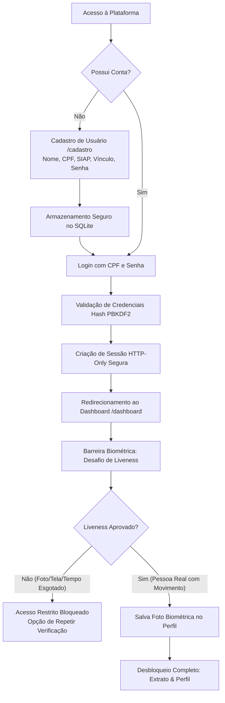

# 👁️ Sistema de Reconhecimento Facial & Controle de Acesso com Liveness (Anti-Spoofing)

<p align="center">
  
  &nbsp;&nbsp;
  
</p>
<p align="center">
  <em>Interfaces Desktop e Mobile (PWA Instalável) do Sistema de Reconhecimento Facial e Controle de Acesso</em>
</p>

<p align="center">
  
  
  
  
  
  
  
  
</p>

---

## 📌 Sobre o Projeto

O **Sistema de Reconhecimento Facial & Controle de Acesso com Liveness** é uma solução web moderna e progressiva (PWA) para identificação, autenticação em duas etapas e auditoria de presença física.

O sistema combina **autenticação segura por credenciais (CPF + Senha criptografada)** com uma barreira biométrica ativa de **Vivacidade (*Liveness / Proof of Life*)** executada diretamente no navegador via **Client-Side AI**.

### Principais Pilares da Solução

1. **Autenticação em Dois Fatores (2FA: Credenciais + Biometria Viva):**
   - **Fator 1 (Credenciais):** O usuário se autentica com CPF e Senha protegidos por hash PBKDF2/SHA256, gerando uma sessão criptografada em cookie HTTP-Only.
   - **Fator 2 (Liveness & Anti-Spoofing):** No Dashboard, o usuário deve passar obrigatoriamente por uma verificação de vivacidade interativa via câmera para desbloquear as áreas restritas (Extrato, Perfil e Serviços).
2. **Motor de Liveness e Detecção de Ataques de Apresentação (PAD):**
   - Gera desafios biométricos aleatórios (*Anti-Replay*) como piscar de olhos, rotação da cabeça (Yaw) e sorrisos.
   - Analisa a variância temporal de múltiplos frames para rejeitar fotos estáticas impressas, telas digitais ou vídeos pré-gravados.
3. **Dashboard Completo do Usuário:**
   - **Reconhecimento / Câmera:** Monitoramento em tempo real da validação de vivacidade com feedback dinâmico.
   - **Extrato Financeiro / Acessos:** Visualização detalhada de lançamentos, saldo e histórico de utilização.
   - **Perfil Cadastral:** Informações completas (Nome, CPF formatado, SIAP, Vínculo Acadêmico/Profissional e foto validada).
4. **Gerenciamento Administrativo de Cadastros:**
   - Listagem completa, busca em tempo real por múltiplos campos, indicador de biometria validada, criação e exclusão com segurança.
5. **Privacidade e Conformidade LGPD (100% Client-Side AI):**
   - O processamento das redes neurais ocorre inteiramente no hardware local do usuário via WebAssembly/WebGL com `@vladmandic/face-api`, sem envio de vídeo ou fluxo contínuo para servidores externos.

---

## 🔄 Fluxo de Acesso e Arquitetura



---

## 🧠 Motor de Liveness & Anti-Spoofing (`lib/liveness/liveness-engine.ts`)

A validação de vivacidade foi desenvolvida para barrar ataques de apresentação (fotos estáticas impressas, telas de smartphone, tablets ou monitores) sem depender de APIs externas pagas.

### 1. Cálculos Biométricos em Tempo Real (68 Landmarks)

O sistema extrai 68 coordenadas anatômicas faciais a cada frame e calcula métricas geométricas normalizadas:

- **EAR (Eye Aspect Ratio):** Mede a razão entre as distâncias verticais e horizontais dos olhos para rastrear o ciclo biológico de piscar:
  $$\text{EAR} = \frac{\|p_2 - p_6\| + \|p_3 - p_5\|}{2 \cdot \|p_1 - p_4\|}$$
  O motor rastreia a transição contínua: $\text{Olho Aberto} \rightarrow \text{Olhos Fechando} (\text{EAR} < 0.238) \rightarrow \text{Reabertura}$, confirmando a piscada natural.
- **Head Yaw Ratio (Rotação Horizontal):** Razão entre a posição do nariz (ponto 30) e os extremos mandibulares (pontos 2 e 14) para detectar se o usuário virou a cabeça para a esquerda ou direita:
  $$\text{Yaw Ratio} = \frac{|x_{\text{nariz}} - x_{\text{mandíbula esquerda}}|}{|x_{\text{mandíbula direita}} - x_{\text{nariz}}|}$$
- **Mouth Ratio & Expressões:** Razão entre a largura da comissura labial (pontos 48 e 54) e a distância interocular, combinada com a rede neural `faceExpressionNet` para detecção de sorrisos.
- **Centroide:** Ponto médio ponderado das 68 marcações para aferir estabilidade de enquadramento.

### 2. Desafios Dinâmicos Multietapas (Anti-Replay)

Para evitar vídeos pré-gravados, cada sessão de liveness sorteia uma sequência imprevisível de desafios que devem ser cumpridos em ordem:
- `look_center`: Centralizar o rosto e olhar para a câmera;
- `blink_twice`: Piscar os olhos naturalmente diante da lente;
- `turn_left`: Virar o rosto suavemente para a esquerda;
- `turn_right`: Virar o rosto suavemente para a direita;
- `smile`: Sorrir para a câmera;
- `return_center` e `return_neutral`: Retornar à posição frontal e expressão neutra.

### 3. Detecção de Ataques de Apresentação (PAD - Presentation Attack Detection)

Antes de emitir o veredito positivo, o motor avalia o histórico temporal dos frames coletados:
- **Variância de Movimento Involuntário (Jitter Biológico):** Um ser humano vivo apresenta micro-variações naturais na musculatura e posição. Se o EAR e o Yaw apresentarem variância matemática próxima a zero durante a sessão, o sistema identifica uma foto estática e **reprova com alerta de Spoofing**.
- **Ritmo Temporal Plausível:** O sistema exige no mínimo 15 frames analisados e tempo total superior a 1,2 segundos para impedir injeções artificiais de frames acelerados.
- **Temporizador de 60 Segundos:** Contagem regressiva ativa com encerramento automático caso não haja interação.

---

## 🌟 Módulos e Telas da Aplicação

### 🔐 1. Página Inicial & Autenticação (`/`)
- Formulário de acesso minimalista por **CPF** e **Senha**.
- Máscara dinâmica de formatação para CPF (`000.000.000-00`).
- Atalho para o fluxo de cadastro e verificação automática de sessão ativa para redirecionamento direto ao dashboard.

### 📝 2. Fluxo de Cadastro de Usuário (`/cadastro`)
- Cadastro guiado com validações em tempo real:
  - **Nome Completo:** Validação de tamanho mínimo;
  - **CPF:** Validação algorítmica completa de 11 dígitos com cálculo dos dígitos verificadores (rejeita CPFs inválidos ou sequências repetidas como `111.111.111-11`);
  - **SIAP:** Identificador funcional/acadêmico obrigatório;
  - **Tipo de Usuário:** Seleção entre *Graduação*, *Pós-graduação*, *Professor* ou *Servidor*;
  - **E-mail:** Validação estrutural de formato RFC;
  - **Senha e Confirmação:** Requisito de tamanho mínimo e paridade.
- Gravação segura no banco com hash criptográfico PBKDF2 e salt exclusivo.

### 📊 3. Dashboard do Usuário com 3 Abas (`/dashboard`)

O painel central divide-se em abas dinâmicas:

1. **Aba Reconhecimento (Liveness Security):**
   - Exibição da webcam em tempo real com indicador de enquadramento circular;
   - Passos visuais do desafio sorteado com barra de progresso individual;
   - Mensagens orientativas imediatas (*"Centralize o rosto"*, *"Piscada detectada! Abra os olhos"*, *"Gire para a direita"*);
   - Temporizador regressivo de 60 segundos;
   - Ao concluir com sucesso, a foto biométrica é salva e as abas confidenciais são liberadas.
2. **Aba Extrato:**
   - Resumo financeiro com saldo atual, entradas e saídas;
   - Histórico categorizado de movimentações (alimentação, serviços, recargas) com datas, valores e comprovantes visuais.
3. **Aba Perfil:**
   - Cartão de identificação completo do usuário;
   - Exibição de Nome, CPF formatado, SIAP, Categoria de Vínculo e E-mail;
   - Crachá biométrico com a foto capturada durante o Liveness e selo de segurança *"Biometria Verificada"*.

### 👥 4. Gestão Administrativa de Cadastros (`/cadastros`)
- Painel para consulta de todos os registros persistidos no SQLite;
- Campo de busca instantânea com filtro por Nome, CPF, SIAP ou E-mail;
- Distintivo visual destacando usuários com biometria facial validada versus pendente;
- Modal para cadastro rápido de novos usuários;
- Exclusão segura com modal de confirmação e duplo clique para prevenir remoções acidentais.

### 📱 5. Experiência Mobile & Progressive Web App (PWA)
- **100% Responsivo:** Layout adaptável e otimizado com Tailwind CSS para smartphones, tablets e telas widescreen;
- **Instalação com 1 Toque:** Banner de instalação personalizado (`InstallPwaPrompt.tsx`) na tela inicial permitindo adicionar o app ao celular;
- **Execução Standalone:** Experiência de aplicativo nativo sem barras de URL ou menus do navegador;
- **Cache Local de Redes Neurais:** Pesos de IA cacheados no dispositivo para carregamento instantâneo.

---

## 🛠️ Stack Tecnológica

| Camada | Tecnologia | Finalidade |
| :--- | :--- | :--- |
| **Framework Full-Stack** | Next.js 14.2 (App Router) | Páginas dinâmicas com SSR/CSR e rotas de API REST |
| **Biblioteca de UI** | React 18 | Interfaces reativas, gerenciamento de estado e hooks |
| **Linguagem** | TypeScript 5 | Tipagem estática rigorosa e segurança contra erros em runtime |
| **Visão Computacional & IA** | `@vladmandic/face-api` | Redes neurais MobileNet, 68 Landmarks e Expressões Faciais |
| **Motor de Liveness** | `lib/liveness/liveness-engine.ts` | Desafios anti-replay, EAR, Head Yaw e validação PAD temporal |
| **Segurança & Criptografia** | `lib/auth.ts` (Web Crypto / PBKDF2) | Hashing de senhas com Salt e tokens de sessão HMAC-SHA256 |
| **ORM & Banco de Dados** | Prisma 5 + SQLite (`prisma/dev.db`) | Persistência local estruturada de usuários e dados biométricos |
| **PWA & Cache de Modelos** | `@ducanh2912/next-pwa` + Workbox | Funcionamento offline e cache local dos pesos neurais |
| **Estilização** | Tailwind CSS 3 | Design moderno, limpo (*Light Theme*) e totalmente responsivo |
| **Iconografia** | Lucide React | Ícones vetoriais modernos |

---

## 🗄️ Modelo de Dados (`prisma/schema.prisma`)

```prisma
model User {
  id           String   @id @default(cuid())
  name         String
  cpf          String   @unique
  siap         String   @unique
  userType     String   // Graduação, Pós-graduação, Professor, Servidor
  email        String   @unique
  passwordHash String
  faceImage    String?  // Foto biométrica capturada após validação de vivacidade

  createdAt    DateTime @default(now())
  updatedAt    DateTime @updatedAt
}

model Person {
  id             String   @id @default(cuid())
  name           String
  faceDescriptor String   // Vetor numérico serializado (128 floats)
  createdAt      DateTime @default(now())
  updatedAt      DateTime @updatedAt
}
```

---

## 🔌 Endpoints da API REST

### Autenticação & Sessão
- `POST /api/auth/register` — Cria uma nova conta de usuário com validação de CPF e dados.
- `POST /api/auth/login` — Autentica o usuário por CPF e Senha, emitindo cookie de sessão seguro.
- `GET /api/auth/session` — Verifica a existência de sessão ativa e retorna os dados do usuário.
- `POST /api/auth/logout` — Destrói o cookie de sessão e encerra a conexão.

### Dados do Usuário & Biometria
- `GET /api/user/profile` — Retorna os dados completos do usuário autenticado.
- `GET /api/user/statement` — Retorna os lançamentos e o extrato financeiro/acessos.
- `POST /api/user/face` — Salva a imagem facial validada no perfil do usuário no SQLite.

### Gerenciamento de Cadastros
- `GET /api/cadastros` — Lista todos os usuários cadastrados (com suporte a busca).
- `POST /api/cadastros` — Criação direta de usuário.
- `GET /api/cadastros/[id]` — Consulta individual de um registro.
- `PUT /api/cadastros/[id]` — Atualização cadastral.
- `DELETE /api/cadastros/[id]` — Exclusão definitiva de um usuário.

---

## 📂 Estrutura de Diretórios Atualizada

```text
├── app/
│   ├── api/
│   │   ├── auth/
│   │   │   ├── login/route.ts          # Autenticação por CPF e Senha
│   │   │   ├── logout/route.ts         # Encerramento de sessão
│   │   │   ├── register/route.ts       # Registro com validações estritas
│   │   │   └── session/route.ts        # Consulta de sessão autenticada
│   │   ├── cadastros/
│   │   │   ├── route.ts                # Listagem e criação de cadastros
│   │   │   └── [id]/route.ts           # Consulta, edição e exclusão por ID
│   │   └── user/
│   │       ├── face/route.ts           # Vinculação da foto após Liveness
│   │       ├── profile/route.ts        # Dados de perfil do usuário
│   │       └── statement/route.ts      # Dados de extrato e movimentações
│   ├── cadastro/                       # Página de novo cadastro de usuário
│   ├── cadastros/                      # Painel administrativo de gerenciamento
│   ├── dashboard/                      # Dashboard com Reconhecimento, Extrato e Perfil
│   ├── ~offline/                       # Página de contingência offline PWA
│   ├── layout.tsx                      # Layout base da aplicação
│   ├── not-found.tsx                   # Página 404 personalizada
│   └── page.tsx                        # Home com formulário de login e links
├── components/
│   ├── LivenessSecurityVerification.tsx # Câmera interativa com desafios e validação PAD
│   ├── registration/
│   │   └── StepRegisterFlow.tsx        # Formulário em etapas de cadastro
│   ├── Navbar.tsx                      # Barra de navegação e atalhos
│   ├── Modal.tsx                       # Modais de confirmação e ações
│   └── InstallPwaPrompt.tsx            # Prompt de instalação do PWA
├── lib/
│   ├── auth.ts                         # Hash PBKDF2/SHA256 e tokens de sessão
│   ├── face-api.ts                     # Loader dos pesos neurais e detecção em imagens
│   ├── face-recognition.ts             # Comparação vetorial euclidiana
│   ├── prisma.ts                       # Singleton do Prisma Client
│   ├── validation.ts                   # Validadores de CPF, e-mail e máscaras
│   ├── liveness/
│   │   └── liveness-engine.ts          # Motor de vivacidade, EAR, Yaw e regras PAD
│   └── services/
│       ├── face-service.ts             # Serviço de ciclo de vida dos modelos neurais
│       └── user-service.ts             # Regras de negócio de perfil e extrato
├── prisma/
│   ├── schema.prisma                   # Esquema Prisma (User e Person)
│   └── dev.db                          # Banco de dados SQLite local
├── public/
│   ├── models/                         # Pesos neurais pré-treinados
│   ├── manifest.json                   # Manifesto PWA
│   ├── cover.png                       # Capa e interface Desktop do projeto
│   └── cover-mobile.png                # Capa e interface Mobile (PWA) do projeto
├── scripts/
│   ├── test-liveness-auth.mjs          # Teste das métricas de EAR e regras de Liveness
│   ├── test-mvp-flow.mjs               # Teste do fluxo completo de validação e persistência
│   └── test-system.mjs                 # Testes de integração do Prisma e CRUD
├── next.config.mjs                     # Configurações do Next.js e PWA
└── package.json                        # Dependências e scripts
```

---

## 💻 Como Executar o Projeto Localmente

### Pré-requisitos
- **Node.js** (versão 18.18+ ou 20+)
- **NPM** instalado
- Câmera / Webcam conectada e autorizada no navegador

### 1. Clonar o repositório e entrar na pasta
```bash
git clone <url-do-repositorio>
cd reconhecimento_facial_next-js
```

### 2. Instalar as dependências
```bash
npm install
```

### 3. Sincronizar o banco de dados SQLite
```bash
npx prisma db push
```

### 4. Executar em modo de desenvolvimento
```bash
npm run dev
```

Acesse em seu navegador:
👉 **[http://localhost:3000](http://localhost:3000)**

---

## 🧪 Suíte de Testes Automatizados

Para executar os testes automatizados das rotas e regras de negócio:

### 1. Validação Matemática de Liveness e Anti-Spoofing
Valida o cálculo do EAR, thresholds de decisão e regras da tabela verdade:
```bash
node scripts/test-liveness-auth.mjs
```

### 2. Validação do Fluxo de Usuários, Senhas e Sessões
```bash
node scripts/test-mvp-flow.mjs
```

---

## 🔒 Privacidade e Conformidade com a LGPD

- **Sem Nuvem para Biometria Facial:** Os frames de vídeo e coordenadas faciais são processados **100% no navegador do usuário**, eliminando riscos de vazamento em trânsito.
- **Armazenamento Mínimo:** Apenas uma imagem de referência confirmada pelo teste de vivacidade e os dados cadastrais necessários são mantidos no banco de dados local.
- **Proteção Criptográfica:** Credenciais de acesso são armazenadas usando derivação de chave segura com salt individual (PBKDF2).

---

<p align="center">
  Desenvolvido com foco em alta segurança biométrica, validação ativa de vivacidade (*anti-spoofing*) e privacidade de ponta a ponta.
</p>